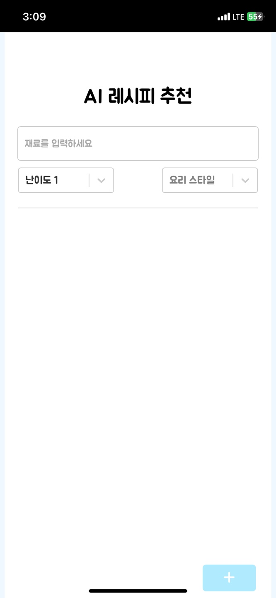

# 🍳재료로 음식 레시피 추천

## 💻사용 기술

- NEXT.js 활용 (프론트엔드, 백엔드)
- GPT API key 사용 (ver 4.0)

## 📄서비스 설명

  

    
  

  

    
- 1. 페이지에서 요리 재료 입력

    
- 2. 자신의 요리 실력에 맞게 난이도 설정

    
- 3. 요리 스타일 선택 (한식, 중식, 일식, 양식 등)

  

- 페이지 안에서 GPT API와 연동된 서버에서 레시피와 링크 추천
- 레시피 내용 확인 가능
- 링크 클릭 시 유튜브 자동 연결
